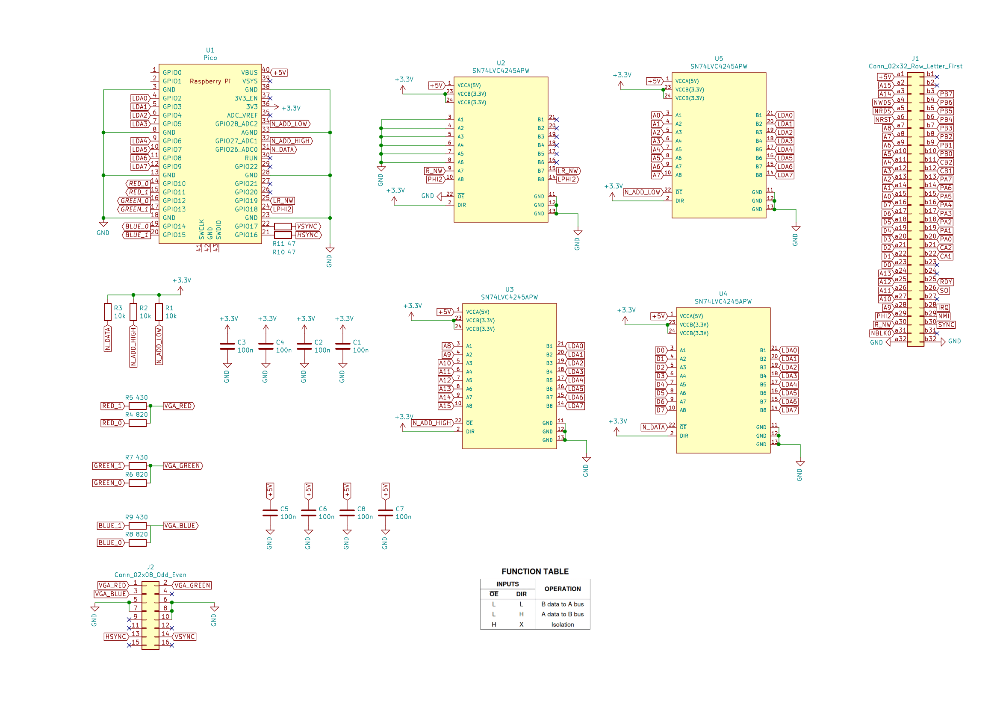

## Atom Vga SID

This repository contains the firmware for the AtomVgaSid project for the Acorn ATOM micro. It does two things:

1. Provides VGA output for the Acorn ATOM. This emulates the MC6847 VDG chip and supports all of the original ATOM text and graphics modes plus a number of different fonts including lower case and a rather useful 80 column mode.

2. Provides a SID emulation. The Commodore 64 SID was never part of the Acorn ATOM but various later expansion boards added the ability to drive a SID chip. There is also a Godil based FPGA implementation of a SID.  

AtomVgaSid works by snooping writes to the ATOM's memory to mirror the data to the pico's memory and uses the pico scanvideo library to generate the video signal.

The SID emulation is provided by the reSID library <https://en.wikipedia.org/wiki/ReSID>

This is the schematic from April 2021 for version 1 of the VGA board. The firmware runs on the Raspberry Pi Pico 2.

## Hardware Overview

#### ATOM Bus Interface

The board connects to the ATOM extension bus PL6/7 via J1**.

The data address buffer IC4 in the ATOM needs to be bypassed to allow access to all addresses. This can be done with wire links or a custom PCB. This is the only modification required to the ATOM.

PL6/7 provides the power for the board and allows it to access the address bus a0-a15, the data bus d0-d7, read-not-write R_NW, clock PHI2 and nRDS. Not shown here is a later modification that connects the DIR pin on U4 to nRDS on the 6502 bus. This enables the pico to support 6502 reads.

U2, U3 and U5 are used to multiplex the 6502 bus onto 8 GPIO pins. The N_ADD_LOW, N_ADD_HIGH and N_DATA signals 
select the low/high address or data bus as required. This means interfacing to the 24 bits of the 6502 bus is 
handled by 11 just GPIO pins.

**(Warning: the labelling of the PL6/7 a and b sides may or may not be correct).

#### VGA Interface

The VGA interface is based on the example in Raspberry Pi pico documenation - see "VGA video" in
<https://datasheets.raspberrypi.com/rp2040/hardware-design-with-rp2040.pdf>.
The main difference is that the AtomVgaSid board provides 2 bits per pixel so that it only uses 8 GPIO pins (GPIO 10 to GPIO 17).

#### Audio Output

A later addition - so also not shown here - the SID analogue audio output is provided using PWM on GPIO pin 21. The audio filter is based on the PWM audio circuit from  <https://datasheets.raspberrypi.com/rp2040/hardware-design-with-rp2040.pdf>

